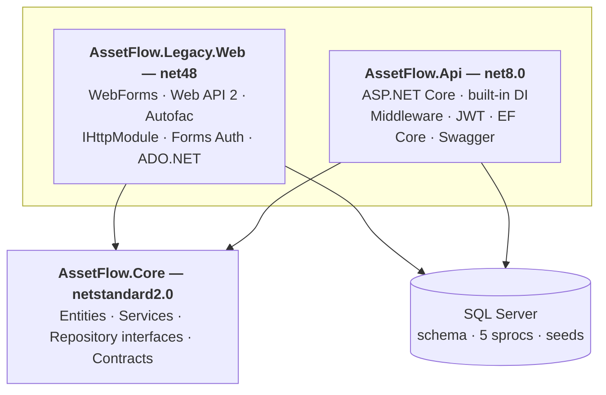

# AssetFlow

Two ASP.NET applications, one database, one shared business-logic library. Built to make the migration patterns from my [.NET Framework to modern .NET blog post](https://qurrat2.github.io/2026/04/27/dotnet-framework-to-net8-migration/) inspectable as code.

> **Status:** Both apps run end-to-end against the same database. Optional YARP Strangler Fig gateway demo is a possible follow-up.

## Architecture



Two apps, one shared business-logic library, one database. The `netstandard2.0` Core is the punchline — the same `IAssetService` is consumed by both `Default.aspx.cs` and `AssetsController.cs` without modification.

## What's working today

- `AssetFlow.Core` (netstandard2.0) — pure C# entities, services, repository interfaces, contracts. Referenced by both apps. Unit-tested.
- `AssetFlow.Legacy.Web` (net48) — WebForms login, dashboard, asset detail (friendly URL via `MapPageRoute`), admin-only assignment flow, logout. Web API 2 JSON controller. Autofac DI, `IHttpModule` request logging, Forms auth, ADO.NET stored procs via `Microsoft.Data.SqlClient`.
- `AssetFlow.Api` (net8.0) — ASP.NET Core API mirroring the legacy domain. EF Core repositories on the same Core interfaces, JWT bearer auth, role-based authorization, request-logging middleware, Swagger UI with the Authorize button wired up. Integration tests via `WebApplicationFactory`.
- Database — schema, 5 stored procs, seeded users, departments, assets.

## Possible follow-ups

- YARP gateway demonstrating per-route Strangler Fig migration.

## Blog claim → code mapping

| Blog topic | Legacy (`net48`) | Modern (`net8.0`) |
|---|---|---|
| Process model: IIS-hosted DLL → Kestrel console | `legacy/AssetFlow.Legacy.Web/` (IIS Express) | `modern/AssetFlow.Api/Program.cs` (`dotnet run`) |
| Configuration | `legacy/AssetFlow.Legacy.Web/Web.config` | `modern/AssetFlow.Api/appsettings.json` |
| Dependency injection | `App_Start/ContainerConfig.cs` (Autofac) | `Program.cs` (built-in `IServiceCollection`) |
| Startup composition | `Global.asax.cs` + `App_Start/*.cs` | `Program.cs` (single file) |
| HTTP pipeline | `Modules/RequestLoggingModule.cs` (`IHttpModule`) | `Middleware/RequestLoggingMiddleware.cs` |
| Authentication | `Auth/FormsAuthHelper.cs` + `<authentication mode="Forms">` in Web.config | `Auth/JwtTokenService.cs` + `AddJwtBearer` in `Program.cs` |
| Role-based authorization | `User.IsInRole("Admin")` checks in code-behind | `[Authorize(Roles = "Admin")]` attribute |
| Data access | `Data/SqlAssetRepository.cs` (ADO.NET + stored procs via `Microsoft.Data.SqlClient`) | `Data/EfAssetRepository.cs` (EF Core 8) |
| JSON serialization | Newtonsoft.Json (Web API 2 default) | System.Text.Json (ASP.NET Core default) |
| HTTP API surface | `Controllers/AssetsApiController.cs` (Web API 2, `ApiController`) | `Controllers/AssetsController.cs` (`ControllerBase`) |
| Pure business logic — ports unchanged | `shared/AssetFlow.Core/Services/AssetService.cs` | *(same file — the punchline)* |
| UI pages | `Login.aspx`, `Default.aspx`, `Assets/Detail.aspx`, `Assets/Assign.aspx` (WebForms) | *none — would be rewritten as Razor Pages or a JS frontend* |

## Running

### Prerequisites

- Visual Studio 2022 or 2026 with the **ASP.NET and web development** workload (legacy needs the WebForms designer)
- .NET Framework 4.8 SDK + targeting pack
- .NET 8 SDK
- SQL Server LocalDB (ships with VS) or any SQL Server 2019+

### Database setup

```bash
sqlcmd -S "(localdb)\MSSQLLocalDB" -i database/01-schema.sql
sqlcmd -S "(localdb)\MSSQLLocalDB" -i database/02-sprocs.sql
sqlcmd -S "(localdb)\MSSQLLocalDB" -i database/03-seeds.sql
```

### Tests

```bash
dotnet test
```

Runs Core unit tests and modern API integration tests (the latter need the seeded database).

### Legacy app

Open `AssetFlow.sln` in Visual Studio, set `AssetFlow.Legacy.Web` as the startup project, press F5. Browser opens at `https://localhost:44xxx/Login.aspx`.

### Modern API

```powershell
dotnet run --project modern\AssetFlow.Api --launch-profile https
```

Swagger UI at `https://localhost:7282/swagger` (port comes from `Properties/launchSettings.json` — adjust if yours differs). Call `POST /api/auth/login` with one of the credentials below, paste the returned token into the **Authorize** dialog, then hit the protected endpoints.

### Default credentials

| Username | Password       | Role  | Department |
|----------|----------------|-------|------------|
| `admin`  | `Password123!` | Admin | (sees all) |
| `alice`  | `Password123!` | Staff | IT (1)     |
| `bob`    | `Password123!` | Staff | Operations (2) |

## License

MIT. See [LICENSE](LICENSE).
