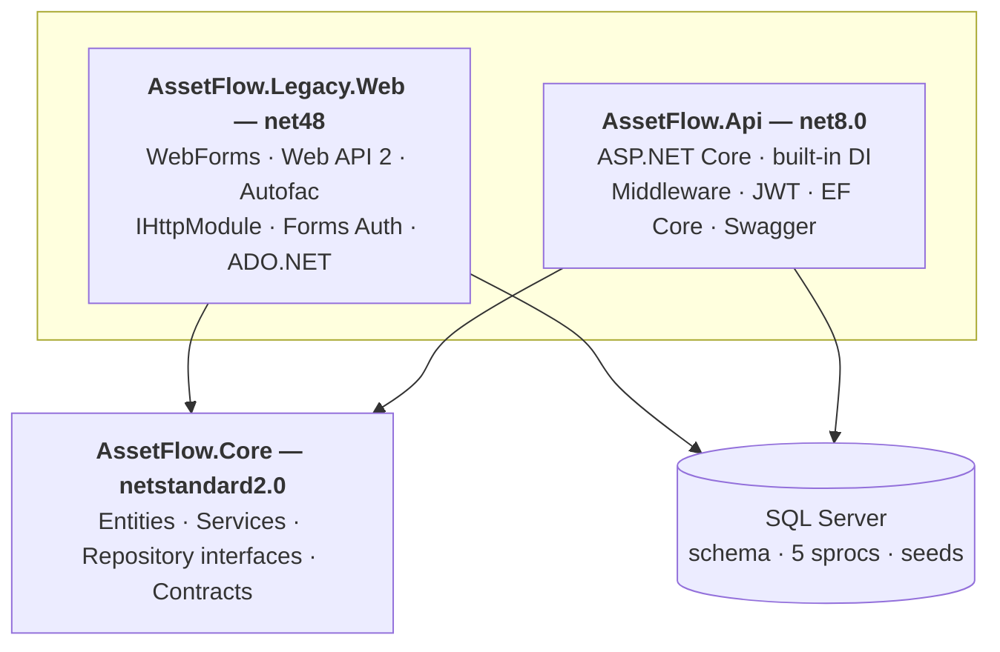

# AssetFlow

Two ASP.NET applications, one database, one shared business-logic library. Built to make the migration patterns from my [.NET Framework to modern .NET blog post](https://qurrat2.github.io/2026/04/27/dotnet-framework-to-net8-migration/) inspectable as code.

> **Status:** Work in progress. The legacy side (.NET Framework 4.8 + WebForms + Web API 2) is complete. The modern API (ASP.NET Core 8) is bootstrapped with EF Core repositories and Swagger; JWT auth, controllers, and integration tests are next.


## Architecture



Two apps, one shared business-logic library, one database. The `netstandard2.0` Core is the punchline — the same `IAssetService` is consumed by both `Default.aspx.cs` and `AssetsController.cs` without modification.

## What's working today

- `AssetFlow.Core` (netstandard2.0) referenced by both apps. Pure C# business logic with `IAssetService`, repository interfaces, contracts. Unit-tested.
- `AssetFlow.Legacy.Web`: WebForms 4.8 app with Login, dashboard, asset detail (with friendly URL via `MapPageRoute`), admin-only assignment flow, logout. Web API 2 controller for JSON. Autofac DI, `IHttpModule`-based request logging, Forms authentication, ADO.NET stored procs via `Microsoft.Data.SqlClient`.
- Database schema, 5 stored procedures, seeded users + assets + departments.

## What's coming

- JWT auth, request-logging middleware, and controllers on the modern side (matching the legacy domain).
- Integration tests for the modern endpoints.
- Full README with a blog-claim → file-path mapping table.
- Optionally: a YARP gateway demonstrating per-route Strangler Fig migration.

## Running the legacy side today

### Prerequisites

- Visual Studio 2022 or 2026 with the **ASP.NET and web development** workload (and .NET Framework 4.8 SDK + targeting pack)
- .NET 8 SDK
- SQL Server LocalDB (ships with VS) or any SQL Server 2019+

### Setup

```bash
# 1. Apply schema, sprocs, and seeds (replace instance name as needed)
sqlcmd -S "(localdb)\MSSQLLocalDB" -i database/01-schema.sql
sqlcmd -S "(localdb)\MSSQLLocalDB" -i database/02-sprocs.sql
sqlcmd -S "(localdb)\MSSQLLocalDB" -i database/03-seeds.sql

# 2. Run the shared library tests to confirm Core is healthy
dotnet test tests/AssetFlow.Core.Tests
```

### Launch the legacy app

Open `AssetFlow.sln` in Visual Studio. Set `AssetFlow.Legacy.Web` as the startup project. Press F5. The browser opens at `https://localhost:44xxx/Login.aspx`.

### Default credentials

| Username | Password       | Role  | Department |
|----------|----------------|-------|------------|
| `admin`  | `Password123!` | Admin | (sees all) |
| `alice`  | `Password123!` | Staff | IT (1)     |
| `bob`    | `Password123!` | Staff | Operations (2) |

## License

MIT. See [LICENSE](LICENSE).
